# Lab Services の Windows Serverの初期セットアップ方法  

初期セットアップとして、新しいラボの作成からGUIの日本語化とタイムゾーンの設定を手動で行います。  

## 新しいラボの作成  
- AzureのLab Servicesを作成し、**ラボの作成**を実行します。  
  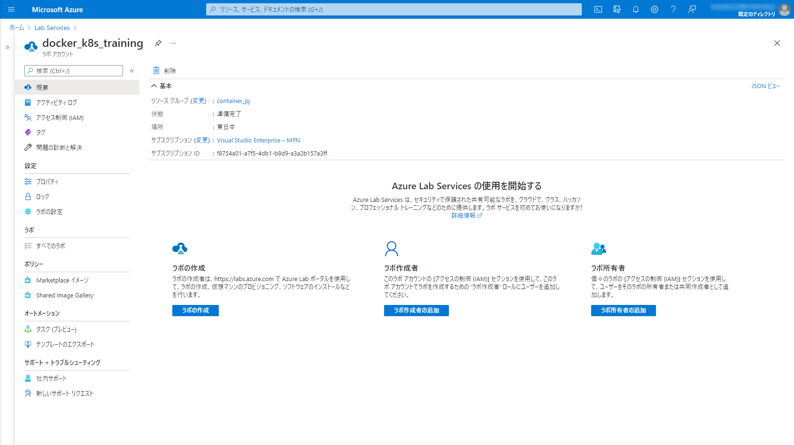  

- **新しいラボ**をクリックし、パラメータを設定します。

|設定名|値|
|:-|:-|
|ラボに名前をつけます|任意のラボの名前|
|使用する仮想マシンのイメージ|Windows Server 2019 Datacenter|
|必要な仮想マシンサイズ|大(入れ子になった仮想化)|  

  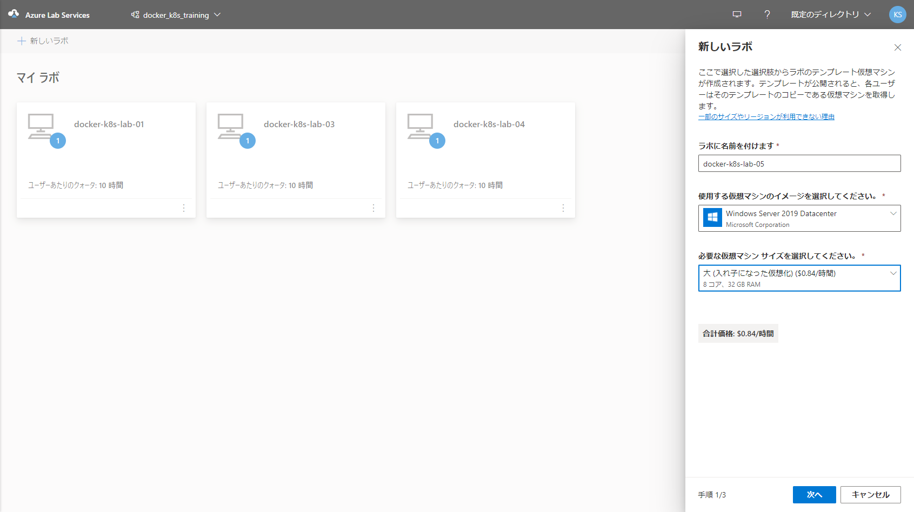  

- ユーザー名とパスワードを指定します。 

|設定名|値|
|:-|:-|
|ユーザー名|labuser|
|パスワード|任意の値|  

  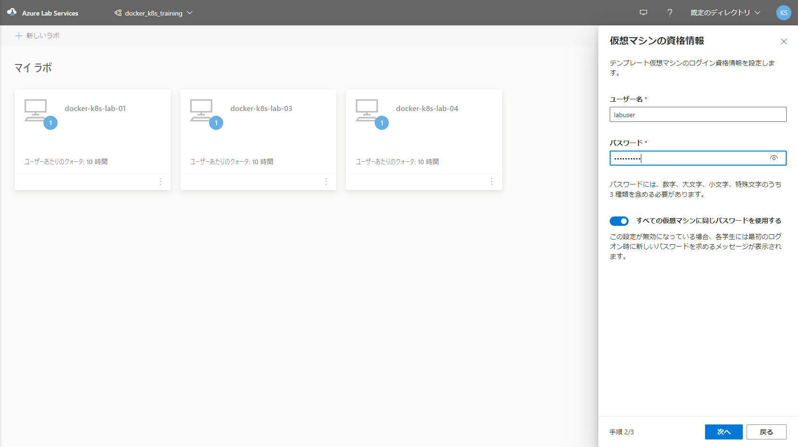  

- ラボポリシーを指定します。ここはデフォルトのまま進みます。  
  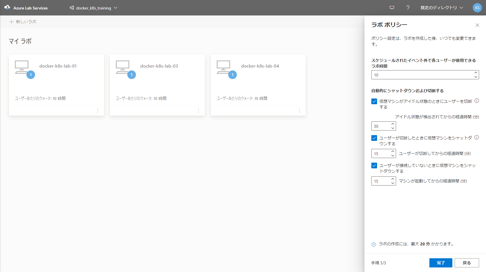  

- ラボが作成されるまで待ちます。  
  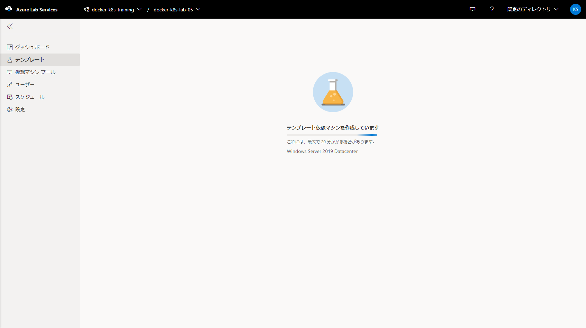

## テンプレートの作成  
Labの仮想マシンのテンプレートを作成します。ここで設定した仮想マシンをテンプレートとしてLab利用者が利用できるようになります。  
ここではベースのセットアップだけ行い、そのほかの設定は各環境にあわせた[Hyper-V用の設定](hyper-v/prepare/RREADME.md)か[VirtualBox用の設定](virtualbox/prepare/README.md)を実施してください。  

### テンプレートへの接続  

- **テンプレートの開始** を実行します。 ここでも数分時間がかります。  
  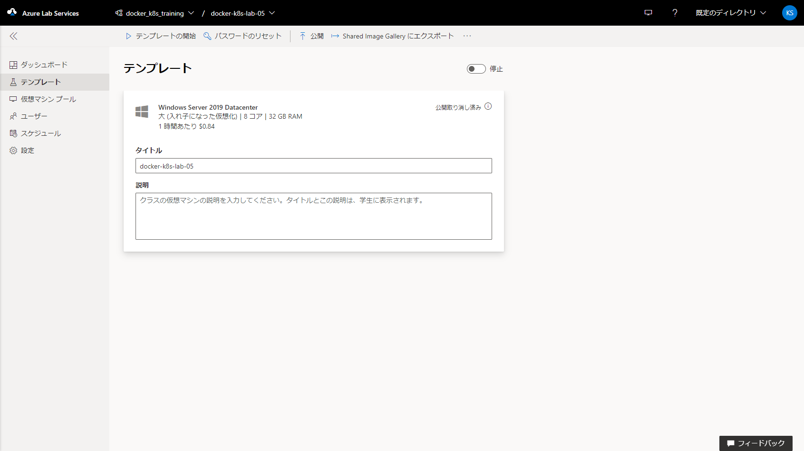  

- テンプレートが開始されたら **テンプレートに接続する**をクリックします。 RDPのショートカットがダウンロードされるので実行します。  
  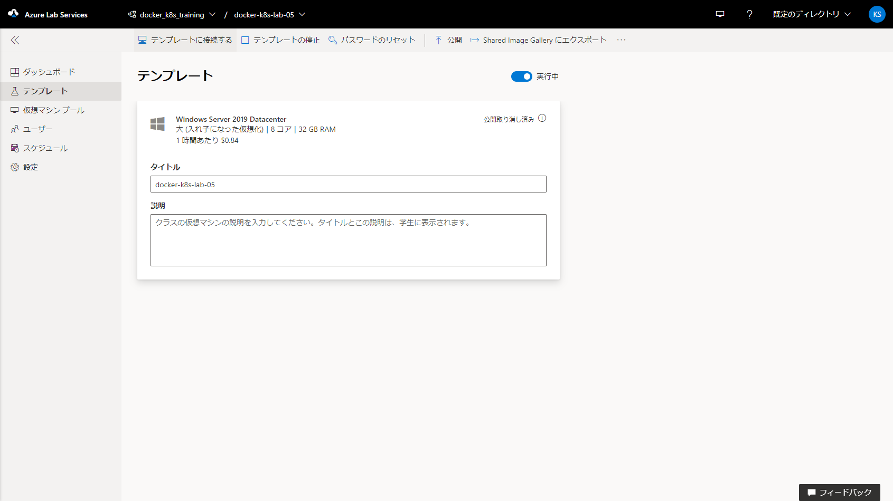 

- 警告が表示されますが、**接続**をクリックし、パスワードを入力して接続します。パスワードはラボ作成時に指定したパスワードです。    
  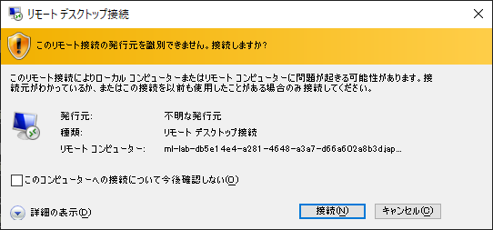 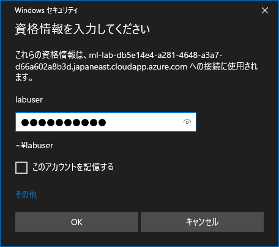  
  証明書の警告も気にせず接続します。  
  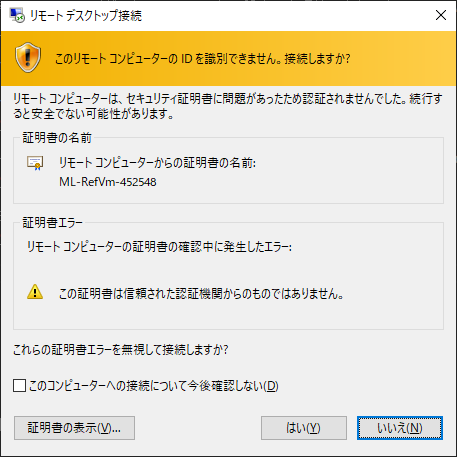  

- リモートデスクトップで接続できます。  
  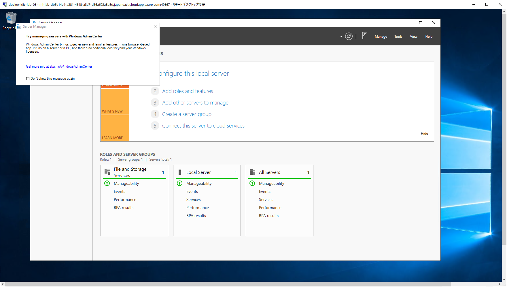  

### 言語設定  

- *Windowsアイコン(スタート) -> 歯車アイコン(Setting)* と移動し、**Time & Language** をクリックします。  
  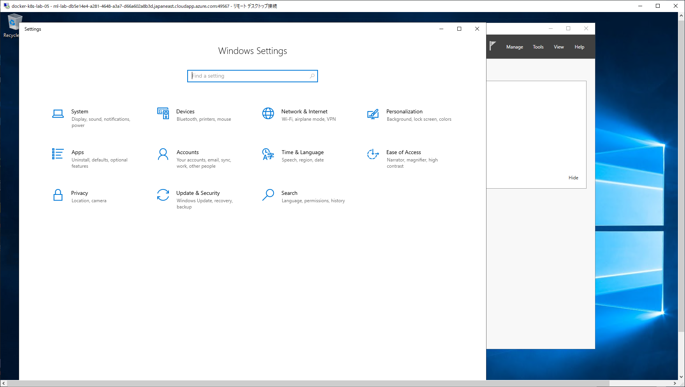  

- *Time zone* を **(UTC+09:00) Osaka,Sapporo,Tokyo** に指定します。  
  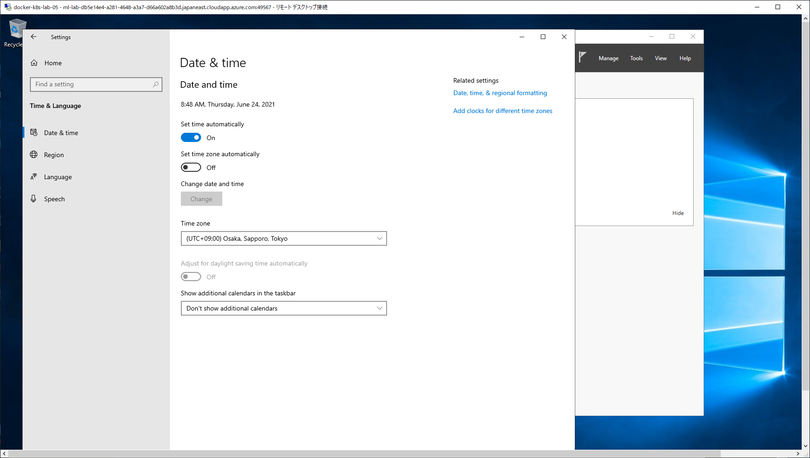  

- *Language* に移動します。  
  **Add a Language** をクリックし、**日本語**を選択、Nextをクリックします。  
  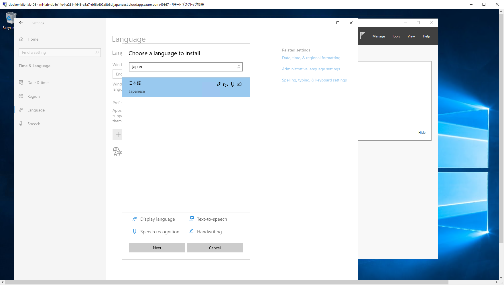  

- *Install Language features* はデフォルトのまま、Install をクリックします。  
  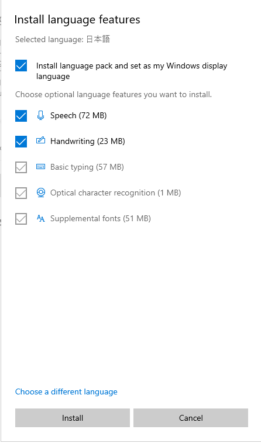  

- インストールが開始されます。少し時間がかかりますので待ちます。  
  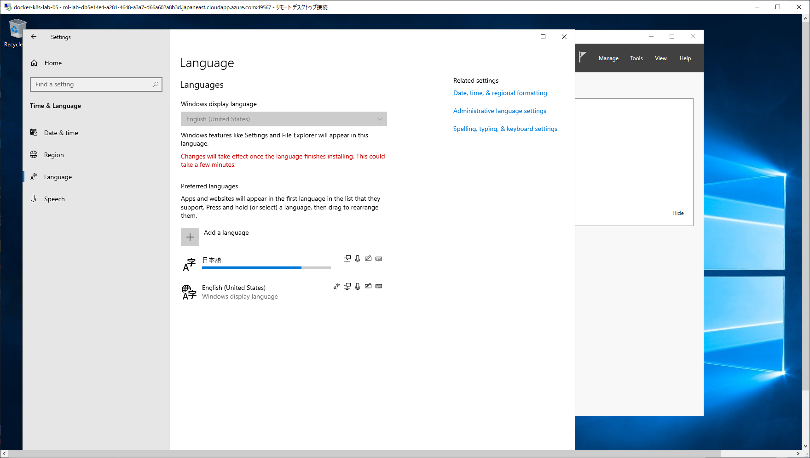  

- インストールが完了すると *Will be display language after next sign-in* を表示されますので、一度サインアウトします。
  このときRDPが切断されます。  
  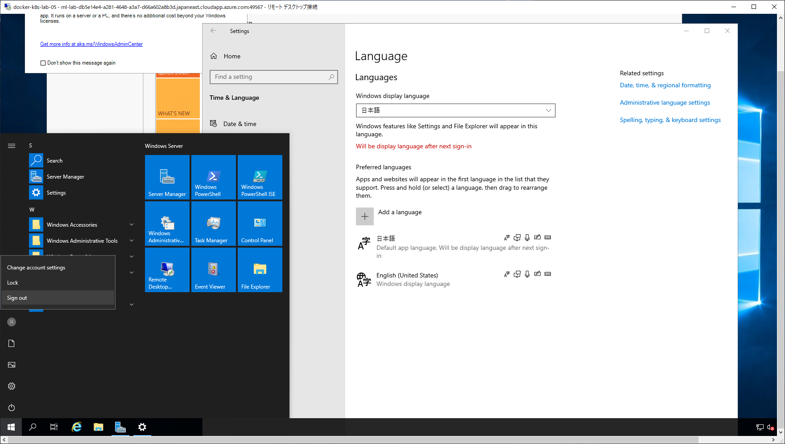

- 再度、ダウンロードしたRDPのショートカットを実行し接続します。
  日本語で表示され、時刻も日本時間となっていることを確認します。  
  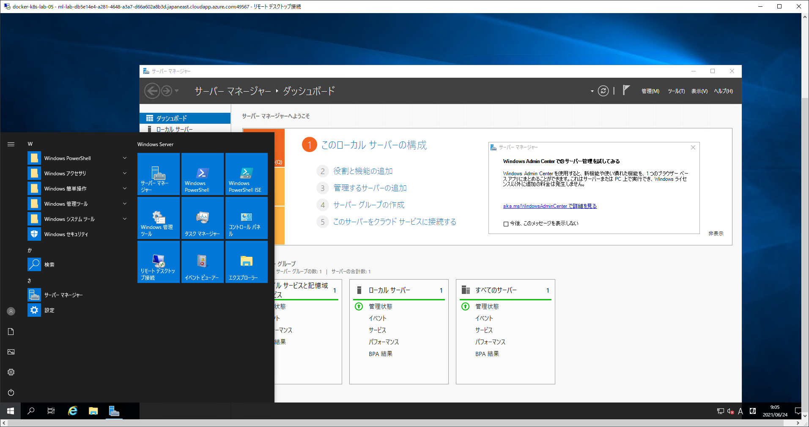  

### 利用環境に合わせた設定  
VirtualBoxとHyper-Vに合わせた設定を行います。  
Azure Lab Servicesを利用する場合、VirtualBoxでは正常に動作しないため、Hyper-V版を利用してください。  

## テンプレートの停止と公開  
すべてのセットアップが完了したら、テンプレートの仮想マシンをシャットダウンし、Azure Lab ServiceのWebUIから **テンプレートの停止** を実行します。  
テンプレートの停止後、**公開** することでラボ利用者がこのテンプレートを利用できるようになります。  

