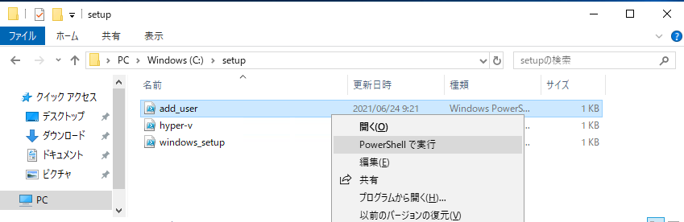

# Hyper-V環境用初期セットアップ  

Hyper-V環境として利用する場合には必須の設定とこのラボで必要な設定を行います。  

## Quick Start  
このディレクトリにあるスクリプトをテンプレートの仮想マシンで実行します。  

```
add_user.ps1
windows_setup.ps1
hyper-v.ps1
```
*hyper-v.ps1*は処理中に再起動が必要になることがあるので、スクリプト実施後OSを再起動し再度スクリプトを実行します。  

- C:\Windows/setup にスクリプトをコピーしています。スクリプトを右クリックし**PowerShellで実行**します。    
    

## ユーザー作成  add_user.ps1
vagrantを使って仮想マシンをデプロイする際に利用します。  
Windowsのローカルユーザーを作成しています。  


## ユーザーが利用するアプリケーションインストール windows_setup.ps1  
ラボ実施時にユーザーが必要とするであろうアプリケーションをインストールしています。  
必要に応じてスクリプトを編集してください。  

### アプリケーションインストール方法  
*chocolaty* を利用しています。インストールされるアプリケーションは下記になります。  

- git
- vscode
- microsoft-edge
- putty
- teraterm
- vagrant

アプリケーションを追加したい場合は[chocolatyのパッケージリスト](https://community.chocolatey.org/packages)から対応を探してスクリプトに追記してください。  
追記のフォーマットは `choco install -force {package_name}` です。  


## Hyper-Vのインストール hyper-v.ps1  
Azure Lab ServiceでHyper-Vを有効にする場合の手順があります。 
https://docs.microsoft.com/ja-jp/azure/lab-services/how-to-enable-nested-virtualization-template-vm  

今回は[スクリプト](https://docs.microsoft.com/ja-jp/azure/lab-services/how-to-enable-nested-virtualization-template-vm-using-script)を利用してインストールを実行します。  

スクリプト実行時に再起動が必要になる場合もありますので、スクリプトを実行し、再起動実行後、再度スクリプトを実行してください。  


