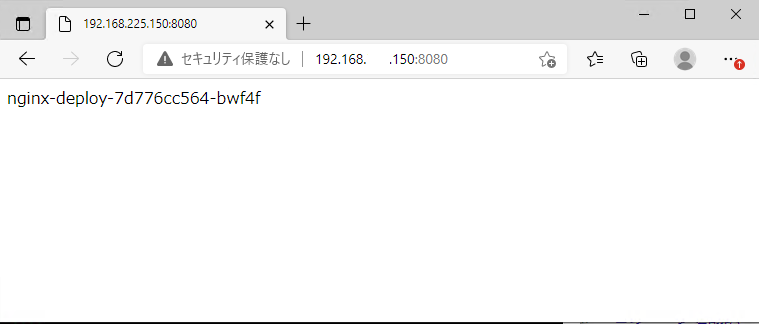

# Kubernetes ハンズオン  

## 目次

## ハンズオン環境の構成  
1Master,3Workerの構成になっています。  
これらはすべてvagrantで立ち上げられ、Kubernetesが実行されている状態になります。  

- Node Spec  

|役割|ノード数|OS|CPU|Memory|Disk1|Disk2|
|:-|:-|:-|:-|:-|:-|:-|
|Master|1|Almalinux|4code|4096MB|20GB||
|Worker|3|Almalinux|4code|4096MB|20GB|10GB|

- Kubernetes  
  - ver. 1.21.0
- CRI-O
  - ver. 1.21.0

### CRI-O (くらいお)  
Dockerの代わりに利用できる軽量のコンテナランタイム。
1.20.0以降はDockerは非推奨になるので変更していますが、Kubernetesの使い勝手的には変わりません。  


## 環境の立ち上げ  
vagrantを使って、環境を立ち上げます。  
また、Powershellだと（作った人的に）都合が悪かったので、**GitBash** を使って作業を行います。

```
cd c:\vm\
git clone https://github.com/keisz/~~~
cd docker-k8s-hands-on/k8s
vagrant up
```

VMが作成されるまで15-20分程度待ちます。  

### 環境の作成方法  
kubeadmを利用してKubernetesクラスタを作成しています。  
実行しているコマンド等は Scripts フォルダのスクリプトを確認してください。  

### ハンズオン用のVM  
下記のVMが実行されます。操作は **master** から実行します。  

|hostname|IP|
|:-|:-|
|master|192.168.225.100|
|worker-1|192.168.225.101|
|worker-2|192.168.225.102|
|worker-3|192.168.225.103|


## VMへのログインと確認   
puttyやTeraterm等でSSH接続が可能です。また、立ち上げ時につかったGitBashの画面上で `vagrant ssh master` とすることで接続できます。

|||
|:-|:-|
|IP|192.168.225.100|
|user|vagrant|
|password|vagrant|

sudoでパスワードを求められた場合もパスワードは **vagrant** です。  


## KubectlからKubernetesクラスタを確認してみる
まずは最初にKubectlを使って、Kubernetesクラスタを確認してみます。  

### クラスタの状態確認  

- クラスタの構成情報を確認  
`kubectl cluster-info`

```
[vagrant@master ~]$ kubectl cluster-info
Kubernetes control plane is running at https://192.168.225.100:6443
CoreDNS is running at https://192.168.225.100:6443/api/v1/namespaces/kube-system/services/kube-dns:dns/proxy

To further debug and diagnose cluster problems, use 'kubectl cluster-info dump'.
```

- クラスタのノード構成を確認

`kubectl get node`
`kubectl get node -o wide`  

```
[vagrant@master ~]$ kubectl get node
NAME                     STATUS   ROLES                  AGE     VERSION
master.training.home     Ready    control-plane,master   22m     v1.21.0
worker-1.training.home   Ready    <none>                 15m     v1.21.0
worker-2.training.home   Ready    <none>                 9m18s   v1.21.0
worker-3.training.home   Ready    <none>                 2m46s   v1.21.0
[vagrant@master ~]$ kubectl get node -o wide
NAME                     STATUS   ROLES                  AGE     VERSION   INTERNAL-IP       EXTERNAL-IP   OS-IMAGE                           KERNEL-VERSION          CONTAINER-RUNTIME
master.training.home     Ready    control-plane,master   22m     v1.21.0   192.168.225.100   <none>        AlmaLinux 8.4 (Electric Cheetah)   4.18.0-305.el8.x86_64   cri-o://1.21.0
worker-1.training.home   Ready    <none>                 15m     v1.21.0   192.168.225.101   <none>        AlmaLinux 8.4 (Electric Cheetah)   4.18.0-305.el8.x86_64   cri-o://1.21.0
worker-2.training.home   Ready    <none>                 9m22s   v1.21.0   192.168.225.102   <none>        AlmaLinux 8.4 (Electric Cheetah)   4.18.0-305.el8.x86_64   cri-o://1.21.0
worker-3.training.home   Ready    <none>                 2m50s   v1.21.0   192.168.225.103   <none>        AlmaLinux 8.4 (Electric Cheetah)   4.18.0-305.el8.x86_64   cri-o://1.21.0
```

> *-o wide*と指定することで詳細な情報を出力することができます。  
> これ以外にも *-o yaml* でyaml形式で出力することもできます。  
> *kubectl get node* 以外でも利用できるので各手順内で確認してみてください。  


## CLIによるPodの実行  
早速、Kubernetes上でコンテナを動かす際の最小単位であるPodを動かしてみます。  

`kubectl run hello-world --image=hello-world -it --restart=Never`  

```
[vagrant@master ~]$ kubectl run hello-world --image=hello-world -it --restart=Never

Hello from Docker!
This message shows that your installation appears to be working correctly.

To generate this message, Docker took the following steps:
 1. The Docker client contacted the Docker daemon.
 2. The Docker daemon pulled the "hello-world" image from the Docker Hub.
    (amd64)
 3. The Docker daemon created a new container from that image which runs the
    executable that produces the output you are currently reading.
 4. The Docker daemon streamed that output to the Docker client, which sent it
    to your terminal.

To try something more ambitious, you can run an Ubuntu container with:
 $ docker run -it ubuntu bash

Share images, automate workflows, and more with a free Docker ID:
 https://hub.docker.com/

For more examples and ideas, visit:
 https://docs.docker.com/get-started/
```  

### Pod を確認してみる  
*kubectl get pod* や *kubectl describe pod {pod_name}* でPodの状態や詳細を確認することができます。  
先ほど試した *-o wide* も併せて確認してみましょう。  

`kubectl get pod`  

`kubectl get pod -o wide`  

`kubectl describe pod hello-world`  


```
[vagrant@master ~]$ kubectl get pod
NAME          READY   STATUS      RESTARTS   AGE
hello-world   0/1     Completed   0          32s
[vagrant@master ~]$ kubectl get pod -o wide
NAME          READY   STATUS      RESTARTS   AGE   IP             NODE                     NOMINATED NODE   READINESS GATES
hello-world   0/1     Completed   0          36s   10.244.3.193   worker-2.training.home   <none>           <none>
[vagrant@master ~]$ kubectl describe pod hello-world
Name:         hello-world
Namespace:    default
Priority:     0
Node:         worker-2.training.home/192.168.225.102
Start Time:   Mon, 21 Jun 2021 14:15:02 +0900
Labels:       run=hello-world
Annotations:  cni.projectcalico.org/podIP:
              cni.projectcalico.org/podIPs:
Status:       Succeeded
IP:           10.244.3.193
IPs:
  IP:  10.244.3.193
Containers:
  hello-world:
    Container ID:   cri-o://1343321264d27e281604dde1281528dd86cc898a94462fe47519ec90f20ba330
    Image:          hello-world
    Image ID:       docker.io/library/hello-world@sha256:1b26826f602946860c279fce658f31050cff2c596583af237d971f4629b57792
    Port:           <none>
    Host Port:      <none>
    State:          Terminated
      Reason:       Completed
      Exit Code:    0
      Started:      Mon, 21 Jun 2021 14:15:12 +0900
      Finished:     Mon, 21 Jun 2021 14:15:12 +0900
    Ready:          False
    Restart Count:  0
    Environment:    <none>
    Mounts:
      /var/run/secrets/kubernetes.io/serviceaccount from kube-api-access-6pksr (ro)
Conditions:
  Type              Status
  Initialized       True
  Ready             False
  ContainersReady   False
  PodScheduled      True
Volumes:
  kube-api-access-6pksr:
    Type:                    Projected (a volume that contains injected data from multiple sources)
    TokenExpirationSeconds:  3607
    ConfigMapName:           kube-root-ca.crt
    ConfigMapOptional:       <nil>
    DownwardAPI:             true
QoS Class:                   BestEffort
Node-Selectors:              <none>
Tolerations:                 node.kubernetes.io/not-ready:NoExecute op=Exists for 300s
                             node.kubernetes.io/unreachable:NoExecute op=Exists for 300s
Events:
  Type    Reason     Age   From               Message
  ----    ------     ----  ----               -------
  Normal  Scheduled  48s   default-scheduler  Successfully assigned default/hello-world to worker-2.training.home
  Normal  Pulling    47s   kubelet            Pulling image "hello-world"
  Normal  Pulled     39s   kubelet            Successfully pulled image "hello-world" in 7.98178352s
  Normal  Created    39s   kubelet            Created container hello-world
  Normal  Started    39s   kubelet            Started container hello-world
```

> Podはどのノードに作成されるか？
> 基本的にはKubernetesが自動でノードの負荷状況などをみて作成するので、管理者側でどこに作成するかを気にする必要はありません
> どうしても指定のノードに作成したい要件がある場合は ラベルをつかった方法やアフィニティ/アンチアフィニティルールを利用します。  

### Podのログを確認してみる  
KubernetesではPodが起動する際に失敗している場合は、*kubectl describe pod {pod_name}*で状況を確認します。
Podが動作しているにもかかわらず、正常な動作になっていない場合は、Podのログを確認します。  

`kubectl logs {pod_name}`  
Hello-worldのログでは下記のように出力されています。

```
[vagrant@master ~]$ kubectl logs hello-world

Hello from Docker!
This message shows that your installation appears to be working correctly.

To generate this message, Docker took the following steps:
 1. The Docker client contacted the Docker daemon.
 2. The Docker daemon pulled the "hello-world" image from the Docker Hub.
    (amd64)
 3. The Docker daemon created a new container from that image which runs the
    executable that produces the output you are currently reading.
 4. The Docker daemon streamed that output to the Docker client, which sent it
    to your terminal.

To try something more ambitious, you can run an Ubuntu container with:
 $ docker run -it ubuntu bash

Share images, automate workflows, and more with a free Docker ID:
 https://hub.docker.com/

For more examples and ideas, visit:
 https://docs.docker.com/get-started/
``` 

### Podの削除
作成したPodを削除します。  
削除は *kubectl delete pod {pod_name}* で実行します。  

`kubectl delete pod hello-world`   
実行後に `kubectl get pod`でPodが削除されていることを確認します。  

```
[vagrant@master ~]$ kubectl delete pod hello-world
pod "hello-world" deleted
[vagrant@master ~]$ kubectl get pod
No resources found in default namespace.
```

## マニフェストを使ったPodの実行  
Kubernetesではマニフェストというファイルを作成し、それをKubernetes APIに読み込ませることでPodなどを作成することが基本的な利用方法になります。  
ここではマニフェストを作成し、Podを実行してみます。  
※サンプルコードを実行し、実際のマニフェストでこうやって動くのかというものを体験してもらえばOKです。マニフェストの書き方の詳細はWebや書籍等で調べていただくか、プロジェクトまでお問い合わせください。  

> マニフェストとは
> Kubernetesのオブジェクトを生成するために、そのオブジェクトに対応するAPIのバージョン、メタ情報、使用などを YAML形式やJSON形式で記述したファイルのことです。  


### Nginx のPodを起動するマニフェストを書いてみる  
下記のファイルをvi やvim などで作成してみてください。  
エディタが必要であれば、 `dnf install {エディタ名}` でインストールしていただいてもOKです。  

- ファイル名: nginx_pod.yaml  
```
apiVersion: v1
kind: Pod
metadata: 
  name: nginx-pod
spec: 
  containers: 
  - name: nginx
    image: nginx:latest
```

コピペ用
```
cat <<EOF > nginx_pod.yaml
apiVersion: v1
kind: Pod
metadata: 
  name: nginx-pod
spec: 
  containers: 
  - name: nginx
    image: nginx:latest
EOF
```

### マニフェストの適用  
マニフェストを *kubectl*コマンドから適用します。  

`kubectl apply -f nginx_pod.yaml`

```
[vagrant@master ~]$ kubectl apply -f nginx_pod.yaml
pod/nginx-pod created
```

マニフェストを適用することで、Kubernetesに命令がわたり、コンテナーイメージがない場合はダウンロードしPodでコンテナーを実行します。  
コンテナーイメージを持っていない場合はダウンロードしますので少し時間がかかります。  

### Podの確認  
Podが作成されていることを確認します。  

`kubectl get pod`
`kubectl describe pod nginx_pod`  

```
[vagrant@master ~]$ kubectl get pod
NAME        READY   STATUS    RESTARTS   AGE
nginx-pod   1/1     Running   0          2m10s
[vagrant@master ~]$ kubectl describe po nginx-pod
Name:         nginx-pod
Namespace:    default
Priority:     0
Node:         worker-3.training.home/192.168.225.103
Start Time:   Mon, 21 Jun 2021 14:17:44 +0900
Labels:       <none>
Annotations:  cni.projectcalico.org/podIP: 10.244.30.65/32
              cni.projectcalico.org/podIPs: 10.244.30.65/32
Status:       Running
IP:           10.244.30.65
IPs:
  IP:  10.244.30.65
Containers:
  nginx:
    Container ID:   cri-o://188c9b740fc066091f2cf505a55e8027ef5265cc6e14ddb4ec9ccc9a2617858f
    Image:          nginx:latest
    Image ID:       docker.io/library/nginx@sha256:61191087790c31e43eb37caa10de1135b002f10c09fdda7fa8a5989db74033aa
    Port:           <none>
    Host Port:      <none>
    State:          Running
      Started:      Mon, 21 Jun 2021 14:18:09 +0900
    Ready:          True
    Restart Count:  0
    Environment:    <none>
    Mounts:
      /var/run/secrets/kubernetes.io/serviceaccount from kube-api-access-rfhwr (ro)
Conditions:
  Type              Status
  Initialized       True
  Ready             True
  ContainersReady   True
  PodScheduled      True
Volumes:
  kube-api-access-rfhwr:
    Type:                    Projected (a volume that contains injected data from multiple sources)
    TokenExpirationSeconds:  3607
    ConfigMapName:           kube-root-ca.crt
    ConfigMapOptional:       <nil>
    DownwardAPI:             true
QoS Class:                   BestEffort
Node-Selectors:              <none>
Tolerations:                 node.kubernetes.io/not-ready:NoExecute op=Exists for 300s
                             node.kubernetes.io/unreachable:NoExecute op=Exists for 300s
Events:
  Type    Reason     Age    From               Message
  ----    ------     ----   ----               -------
  Normal  Scheduled  2m26s  default-scheduler  Successfully assigned default/nginx-pod to worker-3.training.home
  Normal  Pulling    2m26s  kubelet            Pulling image "nginx:latest"
  Normal  Pulled     2m2s   kubelet            Successfully pulled image "nginx:latest" in 23.241993691s
  Normal  Created    2m2s   kubelet            Created container nginx
  Normal  Started    2m2s   kubelet            Started container nginx
```

### Nginxの動作確認  
NginxのpodでサンプルのWebページが表示できるようになっているので、Webページが参照可能か確認します。
しかし、Kubernetesのクラスタの**外**からNginxのPodに接続するには **Service** というものが必要になります。これは後ほど実施するので、ここでは別のPodを立ち上げてPod間の通信で確認してみます。  

- Nginx podのIPアドレス確認
  `kubectl get po -o wide`  
  
```
[vagrant@master ~]$ kubectl get pod -o wide
NAME        READY   STATUS    RESTARTS   AGE     IP            NODE                     NOMINATED NODE   READINESS GATES
nginx-pod   1/1     Running   0          3m15s   10.244.13.1   worker-1.training.home   <none>           <none>
```

- 別Podを対話型で実行してNginxに接続してみる  
  `kubectl run busybox --image=busybox --restart=Never --rm -it sh`
  `wget -q -O - http://10.244.13.1`  <-IPは自身の環境のNginx PodのIPにしてください。

```
[vagrant@master ~]$ kubectl run busybox --image=busybox --restart=Never --rm -it sh
If you don't see a command prompt, try pressing enter.
/ # wget -q -O - http://10.244.13.1
<!DOCTYPE html>
<html>
<head>
<title>Welcome to nginx!</title>
<style>
    body {
        width: 35em;
        margin: 0 auto;
        font-family: Tahoma, Verdana, Arial, sans-serif;
    }
</style>
</head>
<body>
<h1>Welcome to nginx!</h1>
<p>If you see this page, the nginx web server is successfully installed and
working. Further configuration is required.</p>

<p>For online documentation and support please refer to
<a href="http://nginx.org/">nginx.org</a>.<br/>
Commercial support is available at
<a href="http://nginx.com/">nginx.com</a>.</p>

<p><em>Thank you for using nginx.</em></p>
</body>
</html>
/ #
```

`exit` でshから抜けます。その時、同時に一時的に作成した別のPodは削除されます。これはPod実行時に *--rm* を付与したためです。  

```
/ # exit
pod "busybox" deleted
[vagrant@master ~]$
```


### マニフェストを使ったPodの削除  
マニフェストを使って作ったオブジェクトはマニフェストを使って削除することができます。  
*kubectl delete -f {manifest_file}`*で削除されます。

`kubectl delete -f nginx_pod.yaml`  

```
[vagrant@master ~]$ kubectl delete -f nginx_pod.yaml
pod "nginx-pod" deleted
[vagrant@master ~]$ kubectl get pod
No resources found in default namespace.
```

## Deploymentコントローラーを使ったPodのデプロイ
詳細は[こちら](https://kubernetes.io/ja/docs/concepts/workloads/controllers/deployment/)を確認してください。  
わかりやすい動作としては、Deploymentの設定で *Replicas* というものがあり、Deployment(実際にはReplica Set)はそこに指定されたPodが常に動作するように設定してくれます。  

これは
- 要求を待ち続ける
- 水平スケールができる
- 異常終了したら再起動すればよい
ようなアプリケーションに適したものです。  
フロントエンドのWebサーバーなどはこれを使うことで負荷状況に応じて水平スケールすることやローリングアップデートを行うことなども可能です。  
実運用時にはPod単体で動かすのではなく、Deploymentやその他のコントローラーを使ってPodを展開することになります。  

### Deploymentのマニフェストを作成  

下記のファイルをvi やvim などで作成してみてください。  
エディタが必要であれば、 `dnf install {エディタ名}` でインストールしていただいてもOKです。  

- ファイル名: nginx_deployment.yaml  
```
apiVersion: apps/v1
kind: Deployment
metadata: 
  name: nginx-deploy            # Deploymentの名前
spec: 
  replicas: 3                   # Podテンプレート(template以下の項目)からPodをいくつ起動するか
  selector: 
    matchLabels:                # テンプレートとDeploymentを紐づけるラベル
      app: nginx                # spec.template.metadata.labels.以下の値と一致する必要がある
  template:                     # Podのひな型になるテンプレート  
    metadata: 
      labels:
        app: nginx              # spec.selector.matchLabels.以下の値と一致する必要がある
    spec:                       # コンテナの仕様
      containers: 
      - name: nginx
        image: nginx:latest
```

コピペ用
```
cat <<EOF > nginx_deployment.yaml
apiVersion: apps/v1
kind: Deployment
metadata: 
  name: nginx-deploy
spec: 
  replicas: 3
  selector: 
    matchLabels: 
      app: nginx
  template:
    metadata: 
      labels:
        app: nginx
    spec: 
      containers: 
      - name: nginx
        image: nginx:latest
EOF
```

### マニフェストを適用してみる

`kubectl apply -f nginx_deployment.yaml`

```
[vagrant@master ~]$ kubectl apply -f nginx_deployment.yaml
deployment.apps/nginx-deploy created
```

### 作成されたオブジェクトを確認してみる  
いくつかコマンドを実行し、オブジェクトを確認します。

`kubectl get deployment -o wide`
`kubectl get replicaset -o wide`
`kubectl get pod -o wide`

```
[vagrant@master ~]$ kubectl get deployment -o wide
NAME           READY   UP-TO-DATE   AVAILABLE   AGE   CONTAINERS   IMAGES         SELECTOR
nginx-deploy   3/3     3            3           13m   nginx        nginx:latest   app=nginx
[vagrant@master ~]$ kubectl get replicaset -o wide
NAME                      DESIRED   CURRENT   READY   AGE   CONTAINERS   IMAGES         SELECTOR
nginx-deploy-55649fd747   3         3         3       13m   nginx        nginx:latest   app=nginx,pod-template-hash=55649fd747
[vagrant@master ~]$ kubectl get pod -o wide
NAME                            READY   STATUS    RESTARTS   AGE   IP             NODE                     NOMINATED NODE   READINESS GATES
nginx-deploy-55649fd747-995t8   1/1     Running   0          13m   10.244.30.69   worker-3.training.home   <none>           <none>
nginx-deploy-55649fd747-qqpm2   1/1     Running   0          13m   10.244.30.68   worker-3.training.home   <none>           <none>
nginx-deploy-55649fd747-vzdwd   1/1     Running   0          13m   10.244.3.194   worker-2.training.home   <none>           <none>
```

### スケール機能  
Deploymentの*replicas* の値を変更してPodをスケールしてみます。  
**nginx_deployment.yaml**ファイルの **replicas** の値を **10** に変更し、`kubectl apply -f nginx_deployment.yaml` を再度実行します。  

- 変更
```
apiVersion: apps/v1
kind: Deployment
metadata: 
  name: nginx-deploy            # Deploymentの名前
spec: 
  replicas: 10                   # Podテンプレート(template以下の項目)からPodをいくつ起動するか
  selector: 
    matchLabels:                # テンプレートとDeploymentを紐づけるラベル
      app: nginx                # spec.template.metadata.labels.以下の値と一致する必要がある
  template:                     # Podのひな型になるテンプレート  
    metadata: 
      labels:
        app: nginx              # spec.selector.matchLabels.以下の値と一致する必要がある
    spec:                       # コンテナの仕様
      containers: 
      - name: nginx
        image: nginx:latest
```

- 実行
```
[vagrant@master ~]$ kubectl apply -f nginx_deployment.yaml
deployment.apps/nginx-deploy configured

[vagrant@master ~]$ kubectl get pod
NAME                            READY   STATUS    RESTARTS   AGE
nginx-deploy-55649fd747-5dlvl   1/1     Running   0          45s
nginx-deploy-55649fd747-98gfl   1/1     Running   0          45s
nginx-deploy-55649fd747-995t8   1/1     Running   0          22m
nginx-deploy-55649fd747-9djb9   1/1     Running   0          45s
nginx-deploy-55649fd747-gvqpr   1/1     Running   0          45s
nginx-deploy-55649fd747-hhqrl   1/1     Running   0          45s
nginx-deploy-55649fd747-qqpm2   1/1     Running   0          22m
nginx-deploy-55649fd747-qwmbb   1/1     Running   0          45s
nginx-deploy-55649fd747-vcjgh   1/1     Running   0          45s
nginx-deploy-55649fd747-vzdwd   1/1     Running   0          22m
```

*AGE*が45秒のPodが 7個あり、合計10個のPodが動いています。  


### スケールダウン  
10個に増やしたPodを5個に減らしてみます。次はコマンドベースで実行します。  

`kubectl scale --replicas=5 deployment nginx-deploy`

```
[vagrant@master ~]$ kubectl scale --replicas=5 deployment nginx-deploy
deployment.apps/nginx-deploy scaled

[vagrant@master ~]$ kubectl get pod
NAME                            READY   STATUS    RESTARTS   AGE
nginx-deploy-55649fd747-98gfl   1/1     Running   0          3m25s
nginx-deploy-55649fd747-995t8   1/1     Running   0          25m
nginx-deploy-55649fd747-gvqpr   1/1     Running   0          3m25s
nginx-deploy-55649fd747-hhqrl   1/1     Running   0          3m25s
nginx-deploy-55649fd747-qqpm2   1/1     Running   0          25m
```

### ロールアウト  
詳細は[こちら](https://kubernetes.io/ja/docs/concepts/workloads/controllers/deployment/#updating-a-deployment)をご確認ください。  
Podで実行するコンテナーイメージファイルが実際のアプリケーションとなりますが、このコンテナーイメージを更新したときに、マニフェストもしくはCLIでコンテナーイメージを変更することで、アップデートを自動で実行してくれます。  

実際にはロールアウト時の挙動も細かく設定できますが、今回はデフォルト設定のまま、どのように動くか見ていきます。  

- 準備として別のコンソール(teratermやGitBashなど)を開き、masterに接続します。  
  接続後に、`watch -n1 kubectl get pod -o wide` を実行し、Podのステータスを見れるようにしておきます。  

- すでに接続のコンソールから **nginx_deployment.yaml** ファイルを開き、2か所変更します。  

```
apiVersion: apps/v1
kind: Deployment
metadata: 
  name: nginx-deploy            
spec: 
  replicas: 5                   # CLIで 5 に変更しているので、 5 と指定する
  selector: 
    matchLabels:                
      app: nginx                
  template:                       
    metadata: 
      labels:
        app: nginx              
    spec:                       
      containers: 
      - name: nginx
        image: nginx:1.20.1     # latestから 1.20.1 に変更
```

- 適用して変更する。別途立ち上げたコンソールで変更されていく様子を確認する  

```
[vagrant@master ~]$ kubectl apply -f nginx_deployment.yaml
deployment.apps/nginx-deploy configured
[vagrant@master ~]$ kubectl get po
NAME                            READY   STATUS              RESTARTS   AGE
nginx-deploy-55649fd747-98gfl   1/1     Running             0          19m
nginx-deploy-55649fd747-995t8   1/1     Running             0          40m
nginx-deploy-55649fd747-gvqpr   1/1     Terminating         0          19m
nginx-deploy-55649fd747-hhqrl   1/1     Running             0          19m
nginx-deploy-55649fd747-qqpm2   1/1     Running             0          40m
nginx-deploy-7d776cc564-9pjld   0/1     ContainerCreating   0          2s
nginx-deploy-7d776cc564-b8hks   0/1     ContainerCreating   0          2s
nginx-deploy-7d776cc564-skklz   0/1     ContainerCreating   0          2s
[vagrant@master ~]$ kubectl get pod
NAME                            READY   STATUS              RESTARTS   AGE
nginx-deploy-55649fd747-98gfl   1/1     Terminating         0          19m
nginx-deploy-55649fd747-995t8   1/1     Running             0          41m
nginx-deploy-55649fd747-hhqrl   0/1     Terminating         0          19m
nginx-deploy-55649fd747-qqpm2   1/1     Running             0          41m
nginx-deploy-7d776cc564-9pjld   0/1     ContainerCreating   0          25s
nginx-deploy-7d776cc564-b8hks   1/1     Running             0          25s
nginx-deploy-7d776cc564-dqlrw   0/1     ContainerCreating   0          1s
nginx-deploy-7d776cc564-lvt87   0/1     ContainerCreating   0          6s
nginx-deploy-7d776cc564-skklz   1/1     Running             0          25s
[vagrant@master ~]$ kubectl get pod
NAME                            READY   STATUS              RESTARTS   AGE
nginx-deploy-55649fd747-qqpm2   1/1     Terminating         0          41m
nginx-deploy-7d776cc564-9pjld   1/1     Running             0          45s
nginx-deploy-7d776cc564-b8hks   1/1     Running             0          45s
nginx-deploy-7d776cc564-dqlrw   0/1     ContainerCreating   0          21s
nginx-deploy-7d776cc564-lvt87   1/1     Running             0          26s
nginx-deploy-7d776cc564-skklz   1/1     Running             0          45s
[vagrant@master ~]$ kubectl get pod
NAME                            READY   STATUS    RESTARTS   AGE
nginx-deploy-7d776cc564-9pjld   1/1     Running   0          49s
nginx-deploy-7d776cc564-b8hks   1/1     Running   0          49s
nginx-deploy-7d776cc564-dqlrw   1/1     Running   0          25s
nginx-deploy-7d776cc564-lvt87   1/1     Running   0          30s
nginx-deploy-7d776cc564-skklz   1/1     Running   0          49s
```

- Container Imageを確認してみる  
`kubectl describe pod nginx-deploy-********-*****` を実行して利用しているContainer Imageが **nginx:1.20.1** となっていることを確認します。   

```
[vagrant@master ~]$ kubectl describe pod nginx-deploy-7d776cc564-skklz
Name:         nginx-deploy-7d776cc564-skklz
Namespace:    default
Priority:     0
Node:         worker-2.training.home/192.168.225.102
Start Time:   Mon, 21 Jun 2021 16:09:13 +0900
Labels:       app=nginx
              pod-template-hash=7d776cc564
Annotations:  cni.projectcalico.org/podIP: 10.244.3.198/32
              cni.projectcalico.org/podIPs: 10.244.3.198/32
Status:       Running
IP:           10.244.3.198
IPs:
  IP:           10.244.3.198
Controlled By:  ReplicaSet/nginx-deploy-7d776cc564
Containers:
  nginx:
    Container ID:   cri-o://c0ed16de9fa50f4ef1220e964917277bafc7e9dff8595a7eaad58169fbdc8696
    Image:          nginx:1.20.1
    Image ID:       docker.io/library/nginx@sha256:56cbb3c9ada0858d69d19415039ba2aa1e9b357ba9aa9c88c73c30307aae17b0
    Port:           <none>
    Host Port:      <none>
    State:          Running
      Started:      Mon, 21 Jun 2021 16:09:32 +0900
    Ready:          True
    Restart Count:  0
    Environment:    <none>
    Mounts:
      /var/run/secrets/kubernetes.io/serviceaccount from kube-api-access-2dccp (ro)
Conditions:
  Type              Status
  Initialized       True
  Ready             True
  ContainersReady   True
  PodScheduled      True
Volumes:
  kube-api-access-2dccp:
    Type:                    Projected (a volume that contains injected data from multiple sources)
    TokenExpirationSeconds:  3607
    ConfigMapName:           kube-root-ca.crt
    ConfigMapOptional:       <nil>
    DownwardAPI:             true
QoS Class:                   BestEffort
Node-Selectors:              <none>
Tolerations:                 node.kubernetes.io/not-ready:NoExecute op=Exists for 300s
                             node.kubernetes.io/unreachable:NoExecute op=Exists for 300s
Events:
  Type    Reason     Age   From               Message
  ----    ------     ----  ----               -------
  Normal  Scheduled  13m   default-scheduler  Successfully assigned default/nginx-deploy-7d776cc564-skklz to worker-2.training.home
  Normal  Pulling    13m   kubelet            Pulling image "nginx:1.20.1"
  Normal  Pulled     13m   kubelet            Successfully pulled image "nginx:1.20.1" in 16.883457271s
  Normal  Created    13m   kubelet            Created container nginx
  Normal  Started    13m   kubelet            Started container nginx
```

### 自己回復機能  
Deploymentの自己回復機能では、Podが稼働しているノードがダウンした際に replicasで指定したPodを満たすように別ノードで自動的にPodを稼働させます。  
nginx-deploymentのPodが動作しているノードの1台を停止し、Podが回復することを確認してみます。  

- 停止するノードの選択
  先ほど監視用に立ち上げたコンソールを確認し、Podが一番稼働しているノードを選定します。ここでは、**worker-2.training.home** を停止対象とします。  

```
Every 1.0s: kubectl get pod -o wide                                                   master.training.home: Mon Jun 21 16:29:06 2021

NAME                            READY   STATUS    RESTARTS   AGE   IP             NODE                     NOMINATED NODE   READINES
S GATES
nginx-deploy-7d776cc564-9pjld   1/1     Running   0          19m   10.244.3.200   worker-2.training.home   <none>           <none>
nginx-deploy-7d776cc564-b8hks   1/1     Running   0          19m   10.244.3.199   worker-2.training.home   <none>           <none>
nginx-deploy-7d776cc564-dqlrw   1/1     Running   0          19m   10.244.30.71   worker-3.training.home   <none>           <none>
nginx-deploy-7d776cc564-lvt87   1/1     Running   0          19m   10.244.13.5    worker-1.training.home   <none>           <none>
nginx-deploy-7d776cc564-skklz   1/1     Running   0          19m   10.244.3.198   worker-2.training.home   <none>           <none>
```

- Nodeの停止  
  ホストOS（Windows）のスタートメニューから **VirtualBox** を開き、対象のWorkerノードを選択、右クリックし、閉じる->ACPIシャットダウン　を実行します。  
  

- 状態の監視  
  監視用のコンソールでWorker-2で稼働しているPodがどうなるか監視します。
  数分かかるので、シャットダウンしたタイミングの時間を記録しておきます。

  - シャットダウン開始
    - 16:37:13
```
Every 1.0s: kubectl get pod -o wide                                                   master.training.home: Mon Jun 21 16:37:13 2021

NAME                            READY   STATUS    RESTARTS   AGE   IP             NODE                     NOMINATED NODE   READINES
S GATES
nginx-deploy-7d776cc564-9pjld   1/1     Running   0          28m   10.244.3.200   worker-2.training.home   <none>           <none>
nginx-deploy-7d776cc564-b8hks   1/1     Running   0          28m   10.244.3.199   worker-2.training.home   <none>           <none>
nginx-deploy-7d776cc564-dqlrw   1/1     Running   0          27m   10.244.30.71   worker-3.training.home   <none>           <none>
nginx-deploy-7d776cc564-lvt87   1/1     Running   0          27m   10.244.13.5    worker-1.training.home   <none>           <none>
nginx-deploy-7d776cc564-skklz   1/1     Running   0          28m   10.244.3.198   worker-2.training.home   <none>           <none>
```

  - Terminatingが開始され、ContainerCreatingが実行される

```
Every 1.0s: kubectl get pod -o wide                                                   master.training.home: Mon Jun 21 16:42:32 2021

NAME                            READY   STATUS              RESTARTS   AGE   IP             NODE                     NOMINATED NODE
  READINESS GATES
nginx-deploy-7d776cc564-9pjld   1/1     Terminating         0          33m   10.244.3.200   worker-2.training.home   <none>
  <none>
nginx-deploy-7d776cc564-b8hks   1/1     Terminating         0          33m   10.244.3.199   worker-2.training.home   <none>
  <none>
nginx-deploy-7d776cc564-bwf4f   0/1     ContainerCreating   0          4s    <none>         worker-1.training.home   <none>
  <none>
nginx-deploy-7d776cc564-dqlrw   1/1     Running             0          32m   10.244.30.71   worker-3.training.home   <none>
  <none>
nginx-deploy-7d776cc564-jpfff   0/1     ContainerCreating   0          4s    <none>         worker-3.training.home   <none>
  <none>
nginx-deploy-7d776cc564-lvt87   1/1     Running             0          33m   10.244.13.5    worker-1.training.home   <none>
  <none>
nginx-deploy-7d776cc564-skklz   1/1     Terminating         0          33m   10.244.3.198   worker-2.training.home   <none>
  <none>
nginx-deploy-7d776cc564-vx7np   0/1     ContainerCreating   0          4s    <none>         worker-1.training.home   <none>
  <none>
```

  - 5個のPodが稼働状態(running)となる
```
Every 1.0s: kubectl get pod -o wide                                                   master.training.home: Mon Jun 21 16:43:06 2021

NAME                            READY   STATUS        RESTARTS   AGE   IP             NODE                     NOMINATED NODE   READ
INESS GATES
nginx-deploy-7d776cc564-9pjld   1/1     Terminating   0          33m   10.244.3.200   worker-2.training.home   <none>           <non
e>
nginx-deploy-7d776cc564-b8hks   1/1     Terminating   0          33m   10.244.3.199   worker-2.training.home   <none>           <non
e>
nginx-deploy-7d776cc564-bwf4f   1/1     Running       0          37s   10.244.13.7    worker-1.training.home   <none>           <non
e>
nginx-deploy-7d776cc564-dqlrw   1/1     Running       0          33m   10.244.30.71   worker-3.training.home   <none>           <non
e>
nginx-deploy-7d776cc564-jpfff   1/1     Running       0          37s   10.244.30.72   worker-3.training.home   <none>           <non
e>
nginx-deploy-7d776cc564-lvt87   1/1     Running       0          33m   10.244.13.5    worker-1.training.home   <none>           <non
e>
nginx-deploy-7d776cc564-skklz   1/1     Terminating   0          33m   10.244.3.198   worker-2.training.home   <none>           <non
e>
nginx-deploy-7d776cc564-vx7np   1/1     Running       0          37s   10.244.13.6    worker-1.training.home   <none>           <non
e>
```

Worker-2は停止しているため、Podの削除は完了しません。  

#### ノードを復旧するとどうなるか
停止したノードを起動させるとどうなるか確認します。先ほどの監視のコンソールを再度確認します。  

- Workerノードの起動
  停止したWorkerノードをVirtualBoxのコンソールから起動します。  
  

- Podの状態確認  
  監視用のコンソールを確認します。 ノードが起動し、Kubernetesクラスターのノードとして稼働したタイミングでTerminatingとなっていたPodが削除されます。  
  このとき、Podのリスケジュールは**行われません**  
  停止してたWorkerノードではPodが稼働していない状態になります。  

```
Every 1.0s: kubectl get pod -o wide                                                   master.training.home: Mon Jun 21 16:49:24 2021

NAME                            READY   STATUS    RESTARTS   AGE     IP             NODE                     NOMINATED NODE   READIN
ESS GATES
nginx-deploy-7d776cc564-bwf4f   1/1     Running   0          6m56s   10.244.13.7    worker-1.training.home   <none>           <none>
nginx-deploy-7d776cc564-dqlrw   1/1     Running   0          39m     10.244.30.71   worker-3.training.home   <none>           <none>
nginx-deploy-7d776cc564-jpfff   1/1     Running   0          6m56s   10.244.30.72   worker-3.training.home   <none>           <none>
nginx-deploy-7d776cc564-lvt87   1/1     Running   0          39m     10.244.13.5    worker-1.training.home   <none>           <none>
nginx-deploy-7d776cc564-vx7np   1/1     Running   0          6m56s   10.244.13.6    worker-1.training.home   <none>           <none>
```


### サービスを定義してNginx Podにクラスタ外からアクセスしてみる(NodePort)  
Kubernetesでは、WebサーバーのPodなどをデプロイしてもそのままではKubernetes クラスター外部からPodのWebサービスにアクセスすることはできません。  
Podにアクセスするには**サービス**を作成する必要があります。  

サービスにはいくつかのタイプがあります。  
- ClusterIP
- NodePort
- LoadBalancer
- ExternalName

各々の詳細は[こちら](https://kubernetes.io/ja/docs/concepts/services-networking/service/)から確認してください。  

今回は **NodePort**と **LoadBalancer** を使ったサービス公開と試してみます。  
対象のPodは前回利用したNginxをそのまま利用します。  

### NodePortのマニフェストを作ってみる  

下記のファイルを作成します。
- ファイル名: nginx_service.yaml
```
apiVersion: v1
kind: Service
metadata:
  name: nginx-service
spec:
  type: NodePort
  selector:
    app: nginx
  ports:
    - port: 80
      targetPort: 80
      nodePort: 30080
```

- コピペ用  
```
cat <<EOF > nginx_service.yaml
apiVersion: v1
kind: Service
metadata:
  name: nginx-service
spec:
  type: NodePort
  selector:
    app: nginx
  ports:
    - port: 80
      targetPort: 80
      nodePort: 30080
EOF
```

#### ServiceがどうやってPodに紐づけられるか？  
ServiceのマニフェストのSelector部分 **app: nginx** とPodもしくはPod Templateの **spec.template.metadata.label** の値がマッチしていることでServiceと紐づけられます。  


### NodePortのサービスを展開してみる  
*kubectl apply -f*を使って、マニフェストを適用します。  

`kubectl apply -f nginx_service.yaml`

```
[vagrant@master ~]$ kubectl apply -f nginx_service.yaml
service/nginx-service created
[vagrant@master ~]$ kubectl get service
NAME            TYPE        CLUSTER-IP      EXTERNAL-IP   PORT(S)        AGE
kubernetes      ClusterIP   10.96.0.1       <none>        443/TCP        20h
nginx-service   NodePort    10.96.168.111   <none>        80:30080/TCP   6s
[vagrant@master ~]$
```

### クラスタ外からNginxにアクセスしてみる  
Nginxを**nodePort: 30080**で公開していますので、**Port: 30080** にアクセスしてみます。
NodePortを使った場合、接続先のIPは KubernetesクラスタのどこかのノードにアクセスすることでNginx Podにルーティングされます。  
Kubernetesクラスタのすべてのノードの **30080** にアクセスしてみます。  

- ホストOS（Windows）上のWebブラウザを開き、下記にアクセスしてみます。  
  `http://192.168.225.100:30080`
  `http://192.168.225.101:30080`
  `http://192.168.225.102:30080`
  `http://192.168.225.103:30080`

  
  
  
  


### 1つのServiceで複数のPodにトラフィックが分散されることを確認してみる  
NodePortのデフォルト設定では、Serviceに紐づくPodが複数存在する場合、自動的に負荷を分散するようにPodへのアクセスを調整してくれます。  
Nginx Podのindex.htmlでPodのホスト名が表示されるように変更し、分散されているか確認してみます。  

- Nginxのindex.htmlの変更  
  下記のコマンドを実行します。  
  `for pod in $(kubectl get pods |awk 'NR>1 {print $1}'|grep nginx-deploy); do kubectl exec $pod -- /bin/sh -c "hostname>/usr/share/nginx/html/index.html"; done`

- 繰り返しサーバーにアクセスしてみる  
  `while true; do curl http://192.168.225.100:30080; sleep 1; done` 

```
[vagrant@master ~]$ while true; do curl http://192.168.225.100:30080; sleep 1; done
nginx-deploy-7d776cc564-bwf4f
nginx-deploy-7d776cc564-bwf4f
nginx-deploy-7d776cc564-lvt87
nginx-deploy-7d776cc564-vx7np
nginx-deploy-7d776cc564-dqlrw
nginx-deploy-7d776cc564-lvt87
nginx-deploy-7d776cc564-bwf4f
nginx-deploy-7d776cc564-vx7np
nginx-deploy-7d776cc564-lvt87
nginx-deploy-7d776cc564-dqlrw
nginx-deploy-7d776cc564-jpfff
nginx-deploy-7d776cc564-dqlrw
^C
[vagrant@master ~]$
```

複数回アクセスしたら ctrl+Cで終了します。  
別のPodにアクセスしていることが確認できます。  


### LoadBalancerのサービスを使ってみる  
サービスのタイプ LoadBalancer ですが、OSSのKubernetesだけでは利用することができません。  
パブリッククラウドのKubernetesサービスでは、パブリッククラウド側で LoadBalancerタイプを実装していたり、オンプレでは別途LoadBalancerが実装できるようにKubernetesを拡張する必要があります。  
今回は、**MetalLB** というOSSを利用し、LoadBalancerタイプを利用できるようにします。 MetalLBの詳細については説明しません。

#### MetalLBのインストール  

下記のコマンドを実行します。   

```
kubectl get configmap kube-proxy -n kube-system -o yaml | \
sed -e "s/strictARP: false/strictARP: true/" | \
kubectl apply -f - -n kube-system
kubectl apply -f https://raw.githubusercontent.com/metallb/metallb/v0.10.2/manifests/namespace.yaml
kubectl apply -f https://raw.githubusercontent.com/metallb/metallb/v0.10.2/manifests/metallb.yaml
cat <<EOF > metallbconf.yaml
apiVersion: v1
kind: ConfigMap
metadata:
  namespace: metallb-system
  name: config
data:
  config: |
    address-pools:
    - name: default
      protocol: layer2
      addresses:
      - 192.168.225.150-192.168.225.190
EOF
kubectl apply -f metallbconf.yaml
```

#### LoadBalancerのマニフェストを作成  

```
cat << EOF > nginx_lb.yaml
apiVersion: v1
kind: Service
metadata:
  name: nginx
spec:
  selector:
    app: nginx
  ports:
  - protocol: TCP
    port: 8080
    targetPort: 80
  type: LoadBalancer
EOF
```

#### マニフェストを適用してLoadBalancerサービスを作成  

`kubectl apply -f nginx_lb.yaml` と `kubectl get service` を実行  

```
[vagrant@master ~]$ kubectl apply -f nginx_lb.yaml
service/nginx created

[vagrant@master ~]$ kubectl get service
NAME            TYPE           CLUSTER-IP      EXTERNAL-IP       PORT(S)          AGE
kubernetes      ClusterIP      10.96.0.1       <none>            443/TCP          23h
nginx           LoadBalancer   10.100.1.21     192.168.225.150   8080:31731/TCP   6s
nginx-service   NodePort       10.96.168.111   <none>            80:30080/TCP     159m
```

#### 動作確認  
LoadBalancerのアクセス先は*kubectl get service*で表示されたこの情報をもとに行います。  

```
nginx           LoadBalancer   10.100.1.21     192.168.225.150   8080:31731/TCP   6s
```

LoadBalancerは **8080** で待ち受けていますので、 `http://192.168.225.150:8080` にアクセスします。  
  


///-----------一旦ここまで
## Persistent Volume (永続ボリューム)    
コンテナは稼働している状態で作成したデータなどを一時的な領域に保存するのみで、コンテナを停止するとそれらのデータは削除されてしまいます。  
生成したデータを保持するには永続ボリュームが必要となり、それはKubernetesを利用した場合でも同様です。  

Kubernetes の永続ボリュームの作成方法については様々な方法があります。  
今回はKubernetes上にSoftware Defined Storageを構成し、そのストレージをKubernetes上のPodからマウントして利用する方法を試してみます。

詳細は井上さんの資料を確認してください。  

/* 削除するかも
### Persistent VolumeとPersistent Volume ClaimとStorage Class  
Kubernetes上でストレージを利用するときには、下記の組み合わせの設定が必要になります。  

- Persistent Volume Claim + Storage Class
- Persistent Volume Claim + Persistent Volume  

#### Persistent Volume Claim
Persistent Volume Claimはその名の通りVolumeを要求するリソースです。
PodにマウントするストレージをPersistent Volume Claimを使ってSrotageから割り当てるように要求します。

#### Persistent Volume  
Persistent VolumeはPersistent Volume Claimが来た場合の静的なストレージのリストです。  
Persistent Volumeは事前に作成しておき、Persistent Volume Claimが来た時に対応できるPersistent Volumeを割り当てることになります。  
仮にPersistent Volume Claimが20GBのストレージを要求してきた場合にPersistent Volume に 40GB のストレージしか用意されていない場合、40GBの物が割り当てられてしまいます。  
20GB分については使用しないことになるため無駄が発生します。


#### Storage Class
*/

### Portworxのインストール  
今回はSDSとしてPortworxをインストールして利用します。  
SDSとして使うDiskは Workerノードにマウントされている **/dev/sdb** です。  

```
[vagrant@worker-1 ~]$ lsblk
NAME   MAJ:MIN RM  SIZE RO TYPE MOUNTPOINT
sda      8:0    0 19.5G  0 disk
tqsda1   8:1    0    2G  0 part
mqsda2   8:2    0 17.6G  0 part /
sdb      8:16   0   10G  0 disk
```

下記コマンドを実行し、インストールします。  
`kubectl apply -f 'https://install.portworx.com/2.7?comp=pxoperator'`  
少し待ってから、下記を実行
`kubectl apply -f 'https://install.portworx.com/2.7?operator=true&mc=false&kbver=&oem=esse&user=8dea14c3-40dd-11eb-a2c5-c24e499c7467&b=true&c=px-cluster-b7d928f9-cddd-4323-b306-6a68448c8b7e&stork=true&csi=true&lh=true&mon=true&st=k8s&e=storage%3Dportworx&promop=true'`  


```
[vagrant@master ~]$ kubectl apply -f 'https://install.portworx.com/2.7?comp=pxoperator'
serviceaccount/portworx-operator created
clusterrole.rbac.authorization.k8s.io/portworx-operator created
clusterrolebinding.rbac.authorization.k8s.io/portworx-operator created
deployment.apps/portworx-operator created

[vagrant@master ~]$ kubectl apply -f 'https://install.portworx.com/2.7?operator=true&mc=false&kbver=&oem=esse&user=8dea14c3-40dd-11eb-a2c5-c24e499c7467&b=true&c=px-cluster-b7d928f9-cddd-4323-b306-6a68448c8b7e&stork=true&csi=true&lh=true&mon=true&st=k8s&e=storage%3Dportworx&promop=true'
storagecluster.core.libopenstorage.org/px-cluster-b7d928f9-cddd-4323-b306-6a68448c8b7e created
secret/px-essential unchanged
```  

Podやその他のリソースが作成され始めます。  
`kubectl get pod -n kube-system` を実行し、すべてのPodが **Running** となり、*Ready*の値が 2/2 などすべて動いていることを確認します。  
※ 10~15分かかります。  


